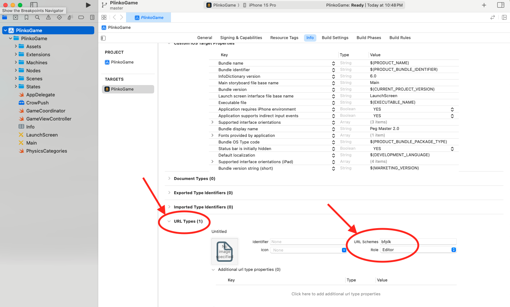
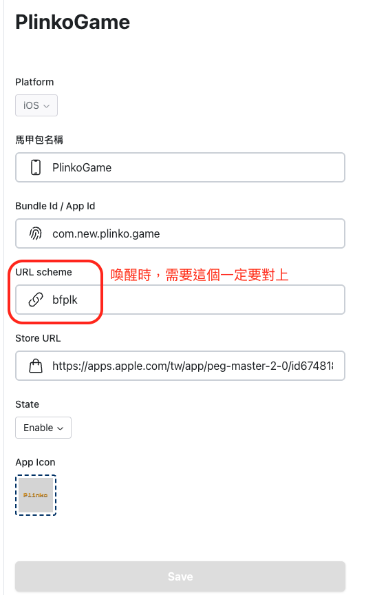
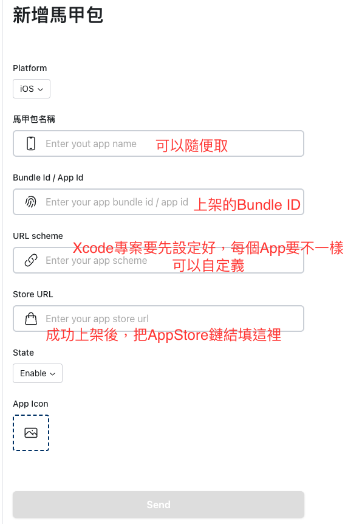

# CrowPushSDK

- [Installaction](#installaction)
- [Usage](#usage)

<br>

## Installaction

### Swift Package Manager (SPM)
In XCode, go to `File -> Add Package ...`, Then enter the url: 
```
https://github.com/balvenie-ios/CrowPush.git
```

### XCFramework
Go to [release](https://github.com/balvenie-ios/CrowPush/releases) page and download the attached file `CrowPush.xcframework.zip`. After extracting the archive, will get `CrowPush.xcframework`.
Simply drag and drop it into your Xcode project.


## Usage

#### Import SDK
```swift
import CrowPush
```

#### Initialization
Add the following in your `AppDelegate.swift`:

```swift
func application(_ application: UIApplication, didFinishLaunchingWithOptions launchOptions: [UIApplication.LaunchOptionsKey: Any]?) -> Bool {
    CrowPush.configure()
    return true
}
```

#### Handling Links
Without `SceneDelegate`

```swift
// AppDelegate.swift
func application(_ app: UIApplication, open url: URL, options: [UIApplication.OpenURLOptionsKey : Any] = [:]) -> Bool {
    CrowPush.openURL(url: url)
    return true
}
```

With `SceneDelegate`, Add the following in `SceneDelegate.swift`
```swift
// Handle deep link when app is in the background
func scene(_ scene: UIScene, openURLContexts URLContexts: Set<UIOpenURLContext>) {
    CrowPush.openURL(contexts: URLContexts)
}

// Handle deep link on cold start (app not running yet)
func scene(_ scene: UIScene, willConnectTo session: UISceneSession, options connectionOptions: UIScene.ConnectionOptions) { 
    let context = connectionOptions.urlContexts
    CrowPush.openURL(contexts: context)
}
```

#### URL Scheme Setup
Configure a custom URL Scheme for your project, and make sure to avoid conflicts with existing app variants.



Then enter the URL Scheme in the crow dashboard.



Example of adding new app in crow dashboard.

